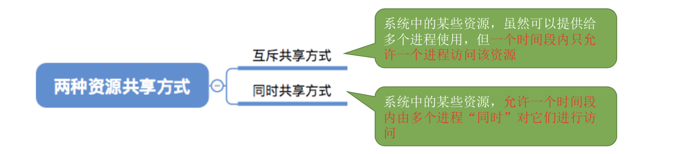

# 2.1-通信基础

### 2.1-1-数据通信相关术语

通信的目的：传送消息

数据：

信号：数据的电气电磁

* 数字信号
* 模拟信号

信源

信宿

信道：信号的传输

### 2.1-2-三种通信方式

* 单工通信
* 半双工通信
* 全双工通信

### 2.1-3-两种数据传输方式

传输方式

* 串行传输
* 并行传输

码元：固定时长的信号波形

这个时长内的信号成为K进制码元，时长称为码元宽度

