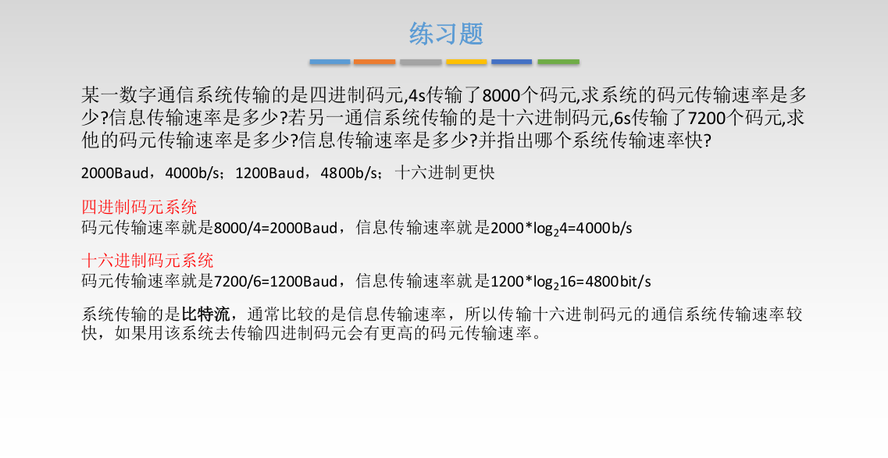

# 3-3--差错控制

### 3.3-1--差错从何而来？

概括来说，传输中的差错都是由于噪音引起的

* 全局性：1.由于线路本身电气特性所产生的随机噪音（热噪声），是信道固有的，随即存在的。 解决办法：提高信噪比来减少或避免干扰。
* 局部性：2.外界特定的短暂原因所造成的冲击噪音，是产生差错的主要原因 解决办法：通常利用编码技术解决。

链路层为网络层提供服务：无确认无连接服务，有确认无连接服务，有确认面向连接服务。

### 3.3-2--数据链路层的差错控制

**冗余编码：**在发送数据之前，先按某种关系**附加**一定的冗余位，构造一个符合某一规则的码字后再发送。当要发送的有效数据变化时，相应的冗余位也随之变化，使码字遵从不变的规则。接收端根据收到码字是否符合原规则，从而判断是否出错。

**奇偶校验码**

只能检测出奇数个比特位的错误，检错能力为50%

**CRC冗余码**

**接收端检错过程**

把收到的每一个帧都除以相同的除数，检查得到的余数R，

* 余数为0，判断这个帧没有差错，接受。
* 余数不为0，哦按段这个帧有差错，无法确定到位，丢弃。

**FCS的生成以及接收端CRC检测都**是由硬件实现，处理很迅速，因此不会延迟数据的传输。

### 3-1-3--检错编码

海明码：发现双比特错误，纠正但比特错误

工作原理：动一发而牵全身

工作流程：

